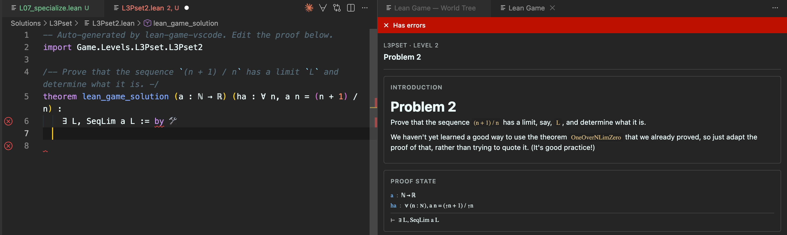
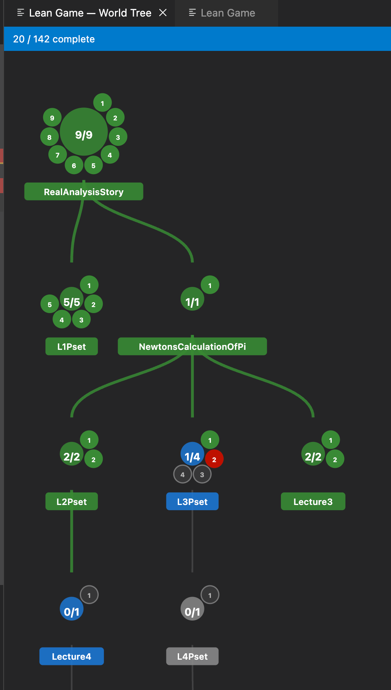

# Lean Game VSCode

Play [lean4game](https://github.com/leanprover-community/lean4game) math games directly in VSCode — write proofs in `.lean` files and get live feedback from the Lean language server, without needing a browser or relay server.



## Features

- **Game panel** — shows the current level's introduction, live proof state (goals and hypotheses at your cursor), hints, and completion status
- **World tree** — visual overview of all worlds and levels with completion progress
  
- **Live proof checking** — powered by the Lean LSP you already have installed; no extra setup
- **Import progress** — import completed levels from a lean4game JSON export

## Requirements

- [VSCode Lean 4 extension](https://marketplace.visualstudio.com/items?itemName=leanprover.lean4) (`leanprover.lean4`) installed and working
- A lean4game-compatible game repository on disk (e.g. [RealAnalysisGame](https://github.com/RealAnalysisGame/RealAnalysisGame))

## Getting Started

1. **Open game** — run `Lean Game: Open Game` (Ctrl+Shift+P) and select the game's root directory (the folder containing `Game.lean`)
2. The extension scans `Game/Levels/` for all levels, generates solution stub files under `Solutions/`, and opens the world tree
3. **Open a level** — click any level dot in the world tree, or open a file from `Solutions/` directly
4. **Write your proof** — replace `sorry` with your tactic proof; the game panel updates live as Lean checks it
5. **Navigate** — use the world tree or the "Next Level" button in the game panel

## Solution Files

Solution files are generated at `<game-root>/Solutions/<world>/<level>.lean`. Each file:

- Imports its corresponding source level file (so all game definitions are in scope)
- Contains a `theorem lean_game_solution` stub with `sorry` as the initial proof body
- Is never overwritten when you reopen the game — your proofs are preserved

## Commands

| Command                                | Description                                           |
| -------------------------------------- | ----------------------------------------------------- |
| `Lean Game: Open Game`                 | Pick a game root directory and load all levels        |
| `Lean Game: Show Panel`                | Reveal the game info panel                            |
| `Lean Game: Show World Tree`           | Reveal the world tree                                 |
| `Lean Game: Import Progress from JSON` | Import completed levels from a lean4game export       |
| `Lean Game: Regenerate Solutions`      | Overwrite all solution stubs with fresh `sorry` files |

## Importing Progress from lean4game

If you have previously played a game on lean4game's website, you can export your progress as JSON (from the game's settings menu) and import it here:

1. Run `Lean Game: Import Progress from JSON`
2. Select the JSON export file
3. For levels with captured proof code the code is written into the solution file; for levels marked complete without code, a marker comment is inserted so the extension tracks them as complete

## Settings

| Setting                 | Description                                                                 |
| ----------------------- | --------------------------------------------------------------------------- |
| `leanGame.gameRootPath` | Absolute path to the game root; the game is auto-loaded on startup when set |

## Building from Source

```bash
npm install
node esbuild.mjs
```

Press **F5** in VSCode to launch an Extension Development Host with the extension loaded.
